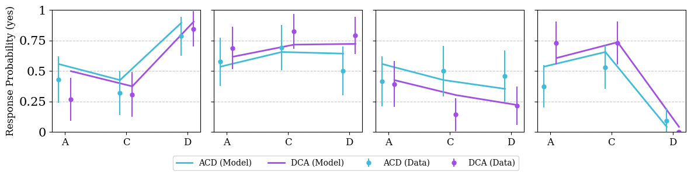
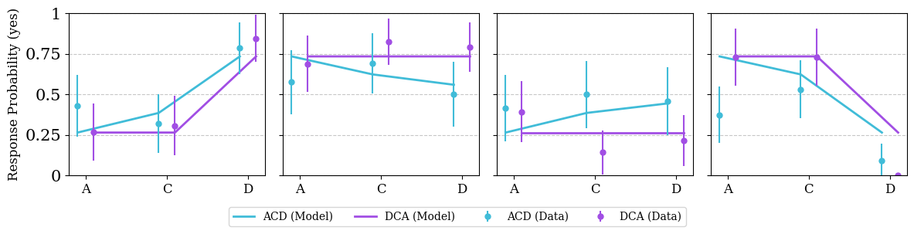
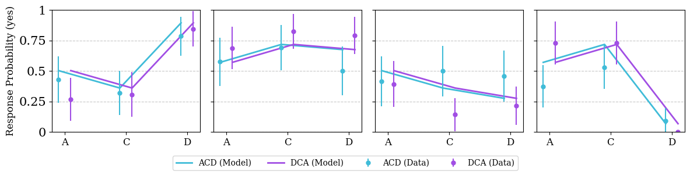
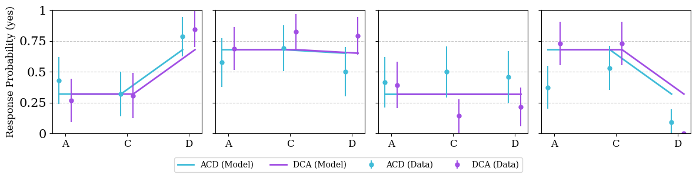

# Explaining Order Effects in Counterfactual Reasoning

This repository contains the code and figures used in the paper "Explaining Order Effects in Counterfactual Reasoning".

Backtracking-Sequential



Pearl-Sequential



Backtracking-Contextless



Pearl-Contextless




## Contents

```
├─– code
│   ├── readme.md
│   ├── ...
├── data
│   ├── experiment_data
│   │   ├── readme.txt
│   │   ├── ...
│   ├── model_fits
│   │   ├── cross_validation
│   │   ├── full_data
├─– README.md
```

All model code and analyses are found in the `./code/` directory including:
- model demonstrations
- results and figures from the paper 
- supplementary analyses

The data is separated based on the original study data `data/experiment_data/` and the model results in `data/model_fits`.

## CRediT


| Term                       	| Nicolas Navarre | Tadeg Quillien   | Dan Lassiter       | Tobias Gerstenberg | Neil Bramley  	|
|----------------------------	|-----------------|------------------|--------------------|--------------------|------------------|
| Conceptualization          	| x          	  | x            	 | x               	  | x         	 | x              	|
| Methodology                	| x          	  | x            	 | x               	  | x         	 | x              	|
| Software                   	| x          	  |             	 |                 	  |           	 |               	|
| Validation                 	| x          	  | x            	 | x               	  | x         	 | x              	|
| Formal analysis            	| x          	  |              	 |                 	  |           	 |                	|
| Investigation              	| x          	  |             	 |                 	  |           	 |                	|
| Resources                  	| x          	  |             	 |                 	  |           	 |                	|
| Data Curation              	| x          	  |             	 |                	  |         	 |                	|
| Writing - Original Draft   	| x          	  |              	 |                 	  |           	 |                	|
| Writing - Review & Editing 	| x          	  | x            	 | x               	  | x         	 | x              	|
| Visualization              	| x          	  |             	 |                 	  |           	 |               	|
| Supervision                	| x          	  | x            	 | x               	  | x         	 | x              	|
| Project administration     	| x          	  |              	 | x               	  | x         	 | x              	|
| Funding acquisition        	|            	  |             	 |                 	  | x         	 |               	|
